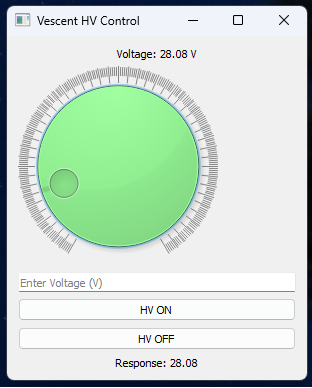

# Vescent-piezo-controller

Python GUI for controlling a Vescent dual-channel high-voltage piezo driver using serial communication.

## Features
- High-voltage ON/OFF control
- Voltage tuning from 0–200 V
- Rotary dial interface
- Manual voltage entry
- Live serial feedback
- Automatic HV shutdown on GUI close

## Installation
Install dependencies:

```bash
pip install -r requirements.txt
```

## Dependencies
- PyQt5
- pyserial

## Hardware
- Vescent high-voltage piezo driver
- Serial communication interface

## GUI Preview

  

## Disclaimer
This software was developed for laboratory and research use.
Users should verify voltage limits and hardware compatibility before operation.


